我建议把这个网站定位成 AI 应用工程师个人作品集（Portfolio），而不是个人博客。

原因是你现在的目标非常明确：深圳/广州 AI 应用岗、秋招转实习。招聘者平均只会看你的网站 30 秒左右，所以网站的任务不是展示生活，而是快速回答三个问题：

1. 你是谁？
2. 你做过什么？
3. 为什么值得约面？

GitHub Pages + Cursor 正好可以做到，而且完全免费。

# 网站整体结构（1 页 + 4 个详情页）

建议采用 Landing Page + Project Detail 的结构，而不是很多页面。

%22%20viewBox%3D%220%200%20320%20220%22%20width%3D%22100%25%22%20xmlns%3D%22http%3A%2F%2Fwww.w3.org%2F2000%2Fsvg%22%3E%3Crect%20width%3D%22320%22%20height%3D%22220%22%20rx%3D%2212%22%20fill%3D%22%23F8FAFC%22%2F%3E%3Crect%20x%3D%2278%22%20y%3D%2212%22%20width%3D%22164%22%20height%3D%2224%22%20rx%3D%228%22%20fill%3D%22%23111827%22%2F%3E%3Ctext%20x%3D%22160%22%20y%3D%2228%22%20font-size%3D%2210%22%20fill%3D%22%23FFFFFF%22%20font-family%3D%22Arial%22%20text-anchor%3D%22middle%22%3EHome%3C%2Ftext%3E%3Crect%20x%3D%2220%22%20y%3D%2248%22%20width%3D%22280%22%20height%3D%2234%22%20rx%3D%228%22%20fill%3D%22%23DBEAFE%22%2F%3E%3Ctext%20x%3D%2232%22%20y%3D%2262%22%20font-size%3D%228%22%20fill%3D%22%231D4ED8%22%20font-family%3D%22Arial%22%20font-weight%3D%22bold%22%3EHero%3C%2Ftext%3E%3Ctext%20x%3D%2232%22%20y%3D%2272%22%20font-size%3D%227%22%20fill%3D%22%231E40AF%22%20font-family%3D%22Arial%22%3EAI%20Application%20Engineer%20%C2%B7%20Shenzhen%3C%2Ftext%3E%3Crect%20x%3D%2220%22%20y%3D%2292%22%20width%3D%22132%22%20height%3D%2244%22%20rx%3D%228%22%20fill%3D%22%23E5E7EB%22%2F%3E%3Ctext%20x%3D%2228%22%20y%3D%22106%22%20font-size%3D%228%22%20fill%3D%22%23111827%22%20font-family%3D%22Arial%22%20font-weight%3D%22bold%22%3ERAG%20Project%3C%2Ftext%3E%3Ctext%20x%3D%2228%22%20y%3D%22116%22%20font-size%3D%227%22%20fill%3D%22%23374151%22%20font-family%3D%22Arial%22%3ECase%20Study%3C%2Ftext%3E%3Crect%20x%3D%22168%22%20y%3D%2292%22%20width%3D%22132%22%20height%3D%2244%22%20rx%3D%228%22%20fill%3D%22%23E5E7EB%22%2F%3E%3Ctext%20x%3D%22176%22%20y%3D%22106%22%20font-size%3D%228%22%20fill%3D%22%23111827%22%20font-family%3D%22Arial%22%20font-weight%3D%22bold%22%3EFinPilot%3C%2Ftext%3E%3Ctext%20x%3D%22176%22%20y%3D%22116%22%20font-size%3D%227%22%20fill%3D%22%23374151%22%20font-family%3D%22Arial%22%3EAI%20Product%3C%2Ftext%3E%3Crect%20x%3D%2220%22%20y%3D%22146%22%20width%3D%22280%22%20height%3D%2224%22%20rx%3D%228%22%20fill%3D%22%23D1FAE5%22%2F%3E%3Ctext%20x%3D%2232%22%20y%3D%22161%22%20font-size%3D%228%22%20fill%3D%22%23065F46%22%20font-family%3D%22Arial%22%20font-weight%3D%22bold%22%3ESkills%3C%2Ftext%3E%3Crect%20x%3D%2220%22%20y%3D%22180%22%20width%3D%22280%22%20height%3D%2224%22%20rx%3D%228%22%20fill%3D%22%23F3F4F6%22%2F%3E%3Ctext%20x%3D%2232%22%20y%3D%22195%22%20font-size%3D%228%22%20fill%3D%22%23374151%22%20font-family%3D%22Arial%22%3EContact%20%C2%B7%20GitHub%20%C2%B7%20Resume%20PDF%3C%2Ftext%3E%3C%2Fsvg%3E)

最终目录：

| 页面                 | 作用              |
| -------------------- | ----------------- |
| `/`                  | 首页（90% 内容）  |
| `/projects/rag`      | RAG 完整案例      |
| `/projects/finpilot` | FinPilot 产品案例 |
| `/about`             | 教育、竞赛、技能  |
| `/404`               | GitHub Pages 必备 |

这样维护成本最低，也最专业。

# 首页布局（最重要）

## Section 1：Hero（第一屏）

第一屏不要放自拍，放一句价值主张。

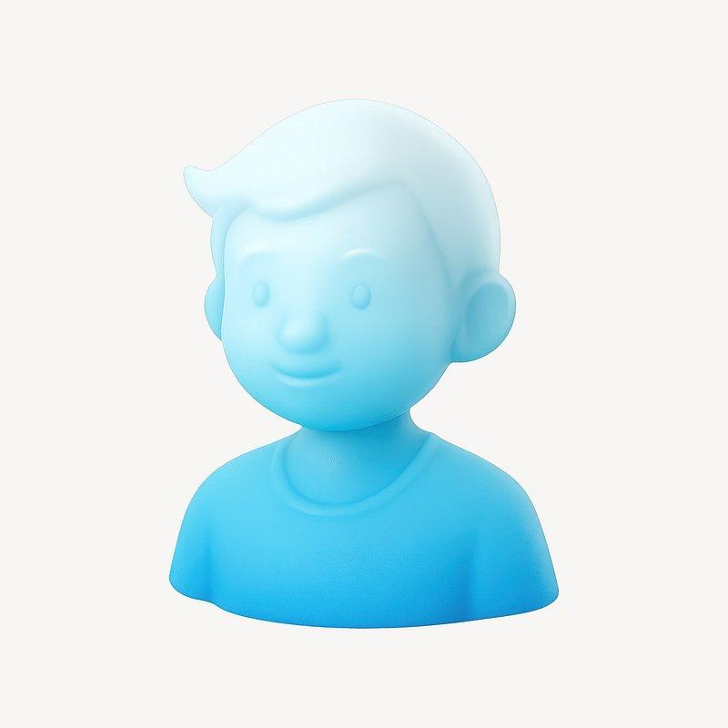

## 霍宝珊

Open to Intern

AI Application Engineer · 深圳 / 广州

LangChain

FastAPI

React

Cursor

专注 AI 应用开发与工作流设计，擅长利用 LLM + RAG 构建真实可落地的产品。

查看项目下载简历

这里解决 HR 的第一印象。

## Section 2：About Me

不是自我介绍，而是数据化。

学历

双非二本 · 信息与计算科学

意向城市

深圳 / 广州

竞赛

数学建模一等奖 · 统计建模二等奖

方向

AI 应用 · Agent · RAG

一眼扫完。

# Section 3：Featured Projects（核心）

这里做成两张大卡片。

### Featured Projects

2 selected works

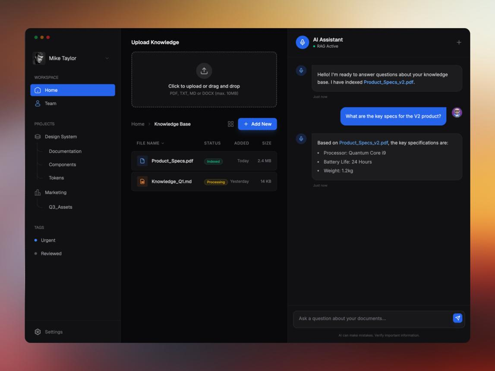

LLM

RAG

FastAPI

### Enterprise RAG Knowledge Base

用 LangChain + Chroma + Ollama 构建企业级知识库问答系统，支持混合检索、语义重排、多轮对话与引用溯源。

GitHub

Demo Video

Case Study

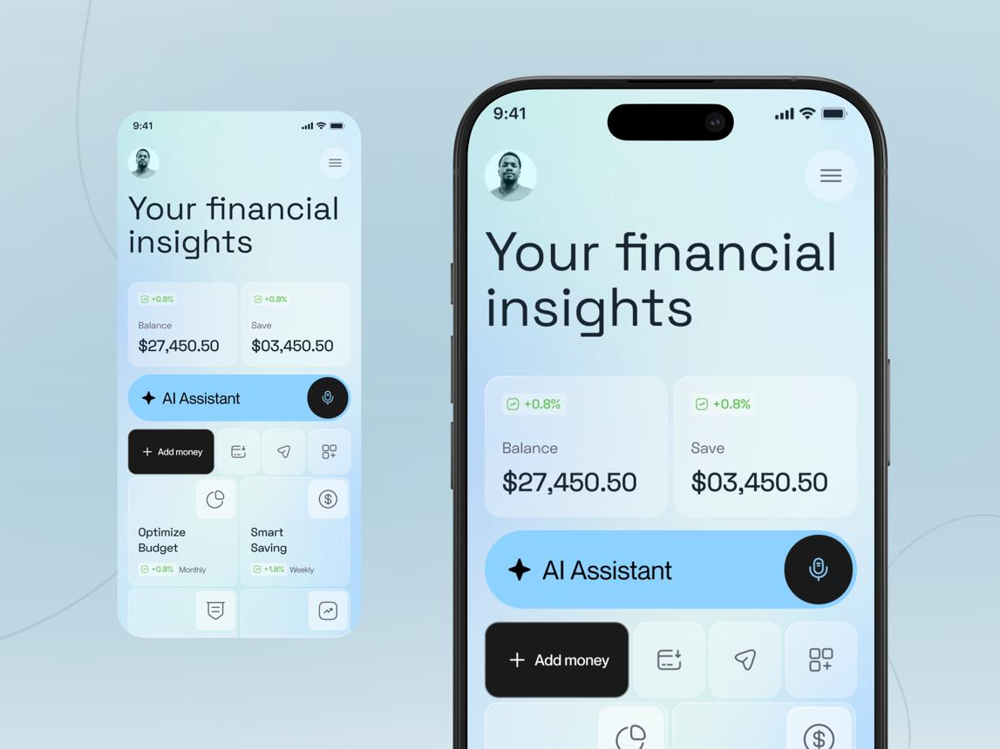

AI Product

React

Workflow

### FinPilot · AI 财务助手

从用户真实预算痛点出发设计 AI 财务产品，实现预算划分、资金归属、消费分析与智能建议。

GitHub

Product Demo

Design Process

注意：封面一定要统一风格。

建议全部深色科技 UI。

# Project Detail 页面怎么做？

招聘真正会看的，是这里。

每个项目都保持一致结构。

## RAG 页面

![Aivia - AI Customer Support Dashboard [Knowledge Base Page] by Ryan Indra for Semusim Team on Dribbble](README.picture/MdZAFe77OIIxpozqWzkPD1Z8L5gNUKErAMxb2nxNbmdjdvo9AjoYRGroBLnKKJUVwjZse1QmVu8fyHWVIenAh4z8_f_QsyAQk44Hq0HJmzCcxDgH9RCFj54duSFZFlq4NakO_6vkUHcHVQDE1Rk9x_r8BPar6MJvLwq6AZmCG5w.jpeg)

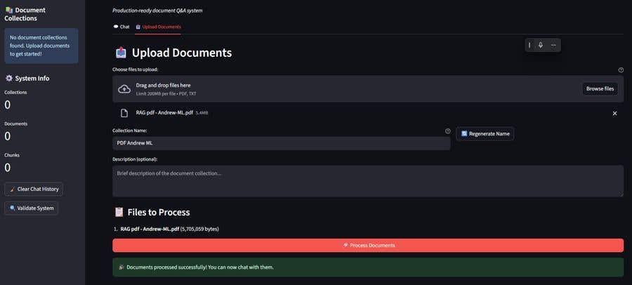

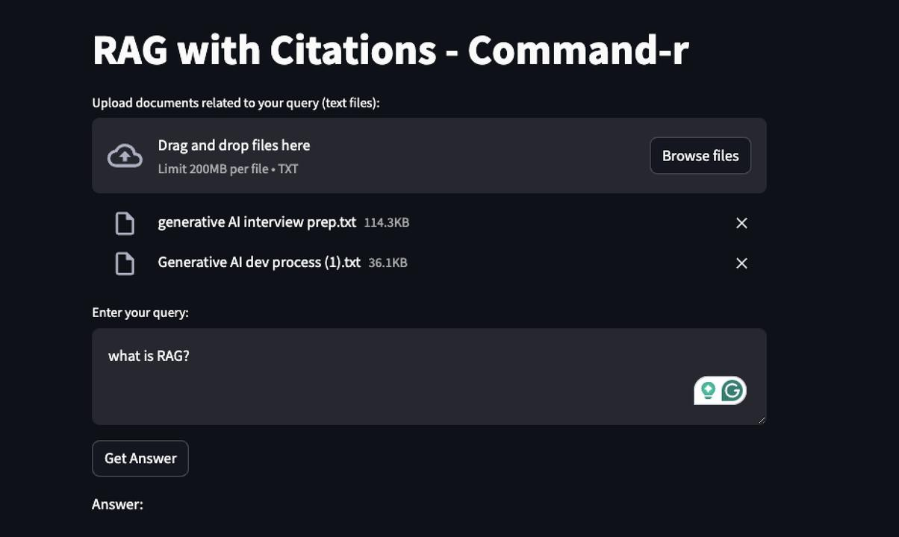

5

# Enterprise RAG Knowledge Base

> 一个真正的项目页面不是放代码，而是讲故事。

周期

5 天

角色

独立开发

技术

LangChain / Chroma

模型

Ollama + Qwen

## ① Problem

企业文档分散，检索效率低。

## ② Solution

用 RAG + Hybrid Retrieval。

## ③ Architecture

%22%20viewBox%3D%220%200%20320%2096%22%20width%3D%22100%25%22%20xmlns%3D%22http%3A%2F%2Fwww.w3.org%2F2000%2Fsvg%22%3E%3Crect%20x%3D%228%22%20y%3D%2228%22%20width%3D%2252%22%20height%3D%2240%22%20rx%3D%228%22%20fill%3D%22%23DBEAFE%22%20stroke%3D%22%232563EB%22%2F%3E%3Ctext%20x%3D%2234%22%20y%3D%2242%22%20font-size%3D%227%22%20text-anchor%3D%22middle%22%20font-family%3D%22Arial%22%20fill%3D%22%231D4ED8%22%3EPDF%3C%2Ftext%3E%3Ctext%20x%3D%2234%22%20y%3D%2250%22%20font-size%3D%227%22%20text-anchor%3D%22middle%22%20font-family%3D%22Arial%22%20fill%3D%22%231D4ED8%22%3EDOCX%3C%2Ftext%3E%3Ctext%20x%3D%2234%22%20y%3D%2258%22%20font-size%3D%227%22%20text-anchor%3D%22middle%22%20font-family%3D%22Arial%22%20fill%3D%22%231D4ED8%22%3EMD%3C%2Ftext%3E%3Cpath%20d%3D%22M60%2048%20H74%22%20stroke%3D%22%2364748B%22%20stroke-dasharray%3D%223%203%22%2F%3E%3Crect%20x%3D%2274%22%20y%3D%2228%22%20width%3D%2252%22%20height%3D%2240%22%20rx%3D%228%22%20fill%3D%22%23D1FAE5%22%20stroke%3D%22%23059669%22%2F%3E%3Ctext%20x%3D%22100%22%20y%3D%2242%22%20font-size%3D%227%22%20text-anchor%3D%22middle%22%20font-family%3D%22Arial%22%20fill%3D%22%23047857%22%3EChunk%3C%2Ftext%3E%3Ctext%20x%3D%22100%22%20y%3D%2250%22%20font-size%3D%227%22%20text-anchor%3D%22middle%22%20font-family%3D%22Arial%22%20fill%3D%22%23047857%22%3EEmbed%3C%2Ftext%3E%3Cpath%20d%3D%22M126%2048%20H140%22%20stroke%3D%22%2364748B%22%20stroke-dasharray%3D%223%203%22%2F%3E%3Crect%20x%3D%22140%22%20y%3D%2228%22%20width%3D%2252%22%20height%3D%2240%22%20rx%3D%228%22%20fill%3D%22%23F3E8FF%22%20stroke%3D%22%237C3AED%22%2F%3E%3Ctext%20x%3D%22166%22%20y%3D%2242%22%20font-size%3D%227%22%20text-anchor%3D%22middle%22%20font-family%3D%22Arial%22%20fill%3D%22%236D28D9%22%3EHybrid%3C%2Ftext%3E%3Ctext%20x%3D%22166%22%20y%3D%2250%22%20font-size%3D%227%22%20text-anchor%3D%22middle%22%20font-family%3D%22Arial%22%20fill%3D%22%236D28D9%22%3ERetrieve%3C%2Ftext%3E%3Cpath%20d%3D%22M192%2048%20H206%22%20stroke%3D%22%2364748B%22%20stroke-dasharray%3D%223%203%22%2F%3E%3Crect%20x%3D%22206%22%20y%3D%2228%22%20width%3D%2252%22%20height%3D%2240%22%20rx%3D%228%22%20fill%3D%22%23FCE7F3%22%20stroke%3D%22%23DB2777%22%2F%3E%3Ctext%20x%3D%22232%22%20y%3D%2242%22%20font-size%3D%227%22%20text-anchor%3D%22middle%22%20font-family%3D%22Arial%22%20fill%3D%22%23BE185D%22%3EReRank%3C%2Ftext%3E%3Ctext%20x%3D%22232%22%20y%3D%2250%22%20font-size%3D%227%22%20text-anchor%3D%22middle%22%20font-family%3D%22Arial%22%20fill%3D%22%23BE185D%22%3ELLM%3C%2Ftext%3E%3Cpath%20d%3D%22M258%2048%20H272%22%20stroke%3D%22%2364748B%22%20stroke-dasharray%3D%223%203%22%2F%3E%3Crect%20x%3D%22272%22%20y%3D%2228%22%20width%3D%2240%22%20height%3D%2240%22%20rx%3D%228%22%20fill%3D%22%23E5E7EB%22%20stroke%3D%22%236B7280%22%2F%3E%3Ctext%20x%3D%22292%22%20y%3D%2242%22%20font-size%3D%227%22%20text-anchor%3D%22middle%22%20font-family%3D%22Arial%22%20fill%3D%22%23374151%22%3EAnswer%3C%2Ftext%3E%3Ctext%20x%3D%22292%22%20y%3D%2250%22%20font-size%3D%227%22%20text-anchor%3D%22middle%22%20font-family%3D%22Arial%22%20fill%3D%22%23374151%22%3E%26amp%3B%20Cite%3C%2Ftext%3E%3C%2Fsvg%3E)

## ④ Demo Video

嵌入你剪好的视频。

## ⑤ Reflection

写 3 点优化。

这比 README 高一个层次。

## FinPilot 页面

重点不是代码，而是 产品思维。

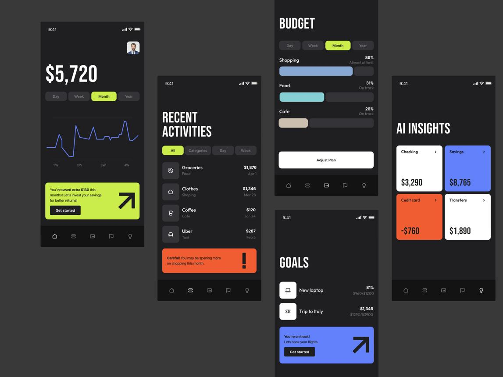

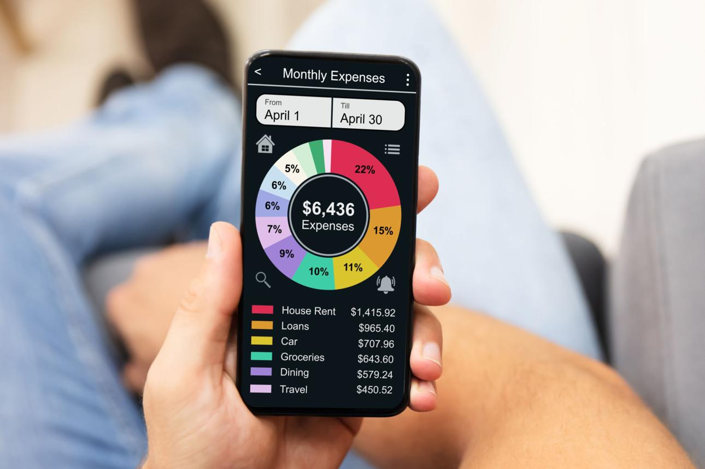

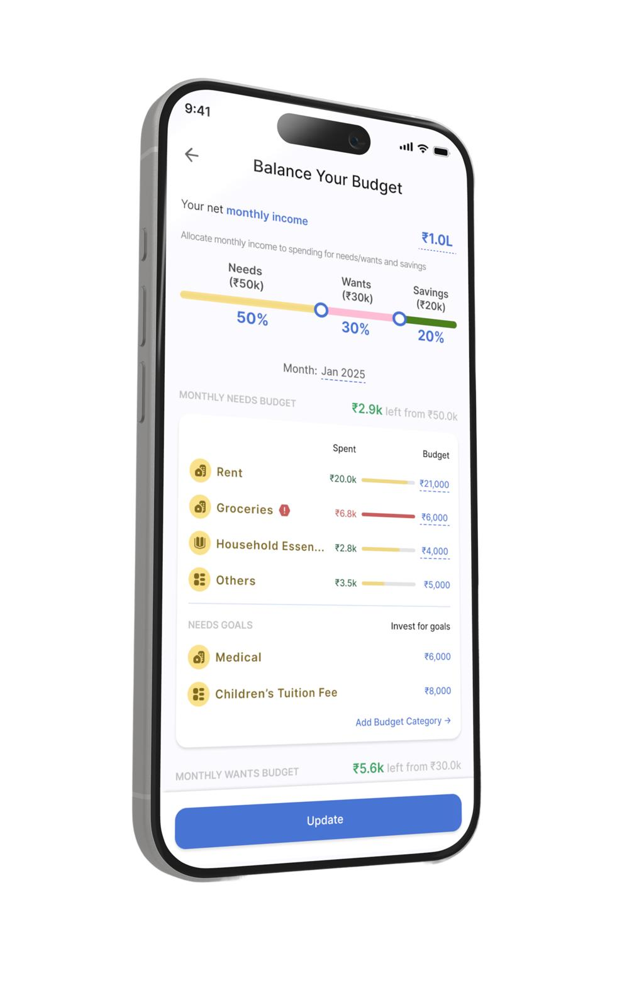

7

结构：

- 用户痛点（为什么做）
- 用户画像
- PRD 摘要
- 功能流程图
- AI 工作流
- Demo 视频
- 下一步规划

HR 会觉得你不仅会写代码，还会做产品。

# Skills 页面怎么设计？

不要放 20 个 logo。

做成能力矩阵。

## Tech Stack

AI 应用

LangChain · OpenAI SDK · Ollama · DashScope

Backend

Python · FastAPI · SQLAlchemy

Frontend

React · Next.js · Tailwind

Engineering

Git · Docker · GitHub Actions

下面再放竞赛即可。

# Contact（最后一屏）

保持极简。

## Let's Build Something

寻找 AI 应用 / Agent / 自动化方向实习机会。

# 网站视觉风格（推荐）

我建议直接参考 Vercel + Linear 的设计。

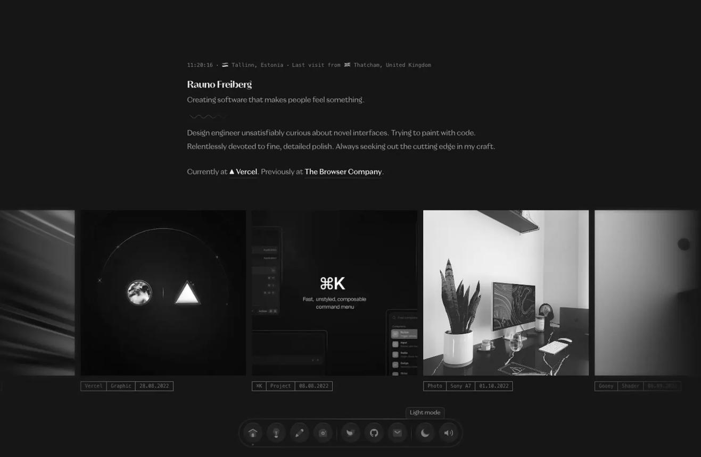

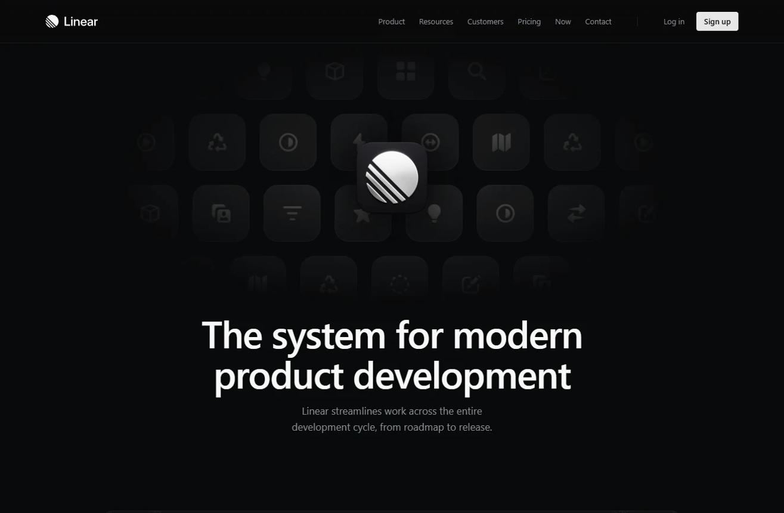

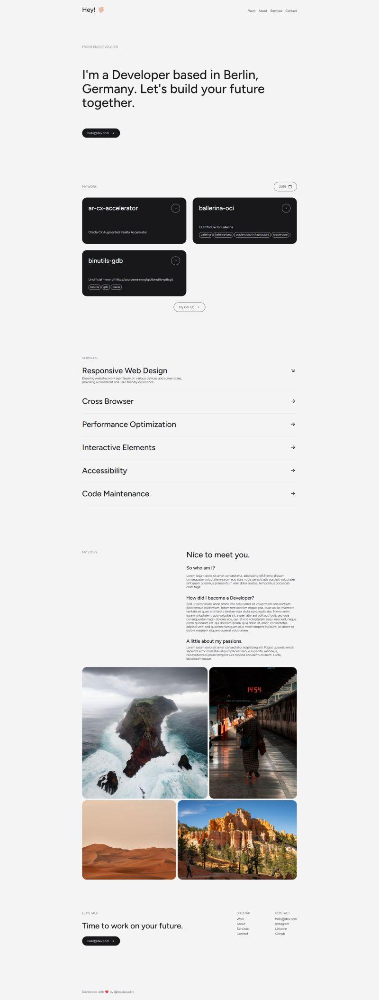

6

关键词：

- 深色背景（#0A0A0A）
- 白色文字
- 蓝紫渐变点缀
- 大留白
- 卡片圆角 20px
- 动画只做淡入

这套最符合 AI 岗。

# 目录结构（Cursor）

```
portfolio/
│
├── public/
│   ├── resume.pdf
│   ├── favicon.ico
│   ├── rag-demo.mp4
│   └── finpilot-demo.mp4
│
├── src/
│   ├── app/
│   │   ├── page.tsx              首页
│   │   ├── about/page.tsx
│   │   └── projects/
│   │        ├── rag/page.tsx
│   │        └── finpilot/page.tsx
│   │
│   ├── components/
│   │   ├── Navbar.tsx
│   │   ├── Hero.tsx
│   │   ├── ProjectCard.tsx
│   │   ├── SkillGrid.tsx
│   │   └── Footer.tsx
│   │
│   └── data/
│       └── projects.ts
│
├── README.md
└── next.config.ts
```

使用 Next.js + Tailwind，部署 GitHub Pages 最简单。

# GitHub Pages 免费部署流程

%22%20viewBox%3D%220%200%20320%2084%22%20width%3D%22100%25%22%20xmlns%3D%22http%3A%2F%2Fwww.w3.org%2F2000%2Fsvg%22%3E%3Crect%20x%3D%228%22%20y%3D%2222%22%20width%3D%2252%22%20height%3D%2240%22%20rx%3D%228%22%20fill%3D%22%23E5E7EB%22%20stroke%3D%22%239CA3AF%22%2F%3E%3Ctext%20x%3D%2234%22%20y%3D%2238%22%20font-size%3D%228%22%20text-anchor%3D%22middle%22%20font-family%3D%22Arial%22%20fill%3D%22%23111827%22%3ECursor%3C%2Ftext%3E%3Ctext%20x%3D%2234%22%20y%3D%2248%22%20font-size%3D%227%22%20text-anchor%3D%22middle%22%20font-family%3D%22Arial%22%20fill%3D%22%23374151%22%3ENext.js%3C%2Ftext%3E%3Cpath%20d%3D%22M60%2042%20H74%22%20stroke%3D%22%2364748B%22%20stroke-dasharray%3D%223%203%22%2F%3E%3Crect%20x%3D%2274%22%20y%3D%2222%22%20width%3D%2252%22%20height%3D%2240%22%20rx%3D%228%22%20fill%3D%22%23DBEAFE%22%20stroke%3D%22%232563EB%22%2F%3E%3Ctext%20x%3D%22100%22%20y%3D%2238%22%20font-size%3D%228%22%20text-anchor%3D%22middle%22%20font-family%3D%22Arial%22%20fill%3D%22%231D4ED8%22%3EGit%3C%2Ftext%3E%3Ctext%20x%3D%22100%22%20y%3D%2248%22%20font-size%3D%227%22%20text-anchor%3D%22middle%22%20font-family%3D%22Arial%22%20fill%3D%22%231D4ED8%22%3EPush%3C%2Ftext%3E%3Cpath%20d%3D%22M126%2042%20H140%22%20stroke%3D%22%2364748B%22%20stroke-dasharray%3D%223%203%22%2F%3E%3Crect%20x%3D%22140%22%20y%3D%2222%22%20width%3D%2252%22%20height%3D%2240%22%20rx%3D%228%22%20fill%3D%22%23D1FAE5%22%20stroke%3D%22%23059669%22%2F%3E%3Ctext%20x%3D%22166%22%20y%3D%2236%22%20font-size%3D%228%22%20text-anchor%3D%22middle%22%20font-family%3D%22Arial%22%20fill%3D%22%23047857%22%3EGitHub%3C%2Ftext%3E%3Ctext%20x%3D%22166%22%20y%3D%2246%22%20font-size%3D%227%22%20text-anchor%3D%22middle%22%20font-family%3D%22Arial%22%20fill%3D%22%23047857%22%3ERepo%3C%2Ftext%3E%3Ctext%20x%3D%22166%22%20y%3D%2254%22%20font-size%3D%227%22%20text-anchor%3D%22middle%22%20font-family%3D%22Arial%22%20fill%3D%22%23047857%22%3EActions%3C%2Ftext%3E%3Cpath%20d%3D%22M192%2042%20H206%22%20stroke%3D%22%2364748B%22%20stroke-dasharray%3D%223%203%22%2F%3E%3Crect%20x%3D%22206%22%20y%3D%2222%22%20width%3D%22106%22%20height%3D%2240%22%20rx%3D%228%22%20fill%3D%22%23F3E8FF%22%20stroke%3D%22%237C3AED%22%2F%3E%3Ctext%20x%3D%22259%22%20y%3D%2236%22%20font-size%3D%228%22%20text-anchor%3D%22middle%22%20font-family%3D%22Arial%22%20fill%3D%22%236D28D9%22%3EGitHub%20Pages%3C%2Ftext%3E%3Ctext%20x%3D%22259%22%20y%3D%2248%22%20font-size%3D%227%22%20text-anchor%3D%22middle%22%20font-family%3D%22Arial%22%20fill%3D%22%236D28D9%22%3Eusername.github.io%3C%2Ftext%3E%3C%2Fsvg%3E)

1. Cursor 开发
2. Push 到 GitHub
3. GitHub Action 自动构建
4. 自动发布到 `username.github.io`

全程 0 元。

# 你的内容准备清单（今天即可完成）

| 内容            | 状态     |
| --------------- | -------- |
| 首页 Hero 文案  | ✅ 已有   |
| 简历 PDF        | ✅ 已完成 |
| RAG 项目截图    | ⏳        |
| RAG 演示视频    | ⏳ 剪辑   |
| FinPilot 截图   | ⏳        |
| FinPilot 视频   | ⏳        |
| GitHub 仓库链接 | ✅        |
| 联系方式        | ✅        |

其实你的网站真正需要制作的素材只有 两段 1~2 分钟的 Demo 视频 + 每个项目 3~4 张截图，其他内容基本都来自你的简历。

## 我建议的开发顺序（2 天）

Day 1（3~4 小时）

- 用 Cursor 初始化 Next.js + Tailwind
- 完成首页布局
- 做 Hero、About、Skills 三个组件
- GitHub Pages 首次部署

Day 2（4 小时）

- 剪 RAG Demo（90 秒）
- 剪 FinPilot Demo（90 秒）
- 完成两个 Project Detail 页面
- 替换真实截图与视频，最终上线

整个网站控制在 5 个页面以内、加载速度快、深色极简风，会比花哨动画更符合 AI 应用工程师岗位的招聘预期。